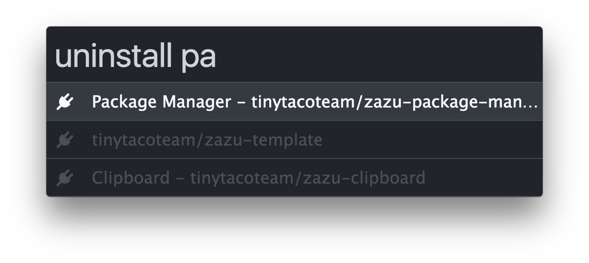
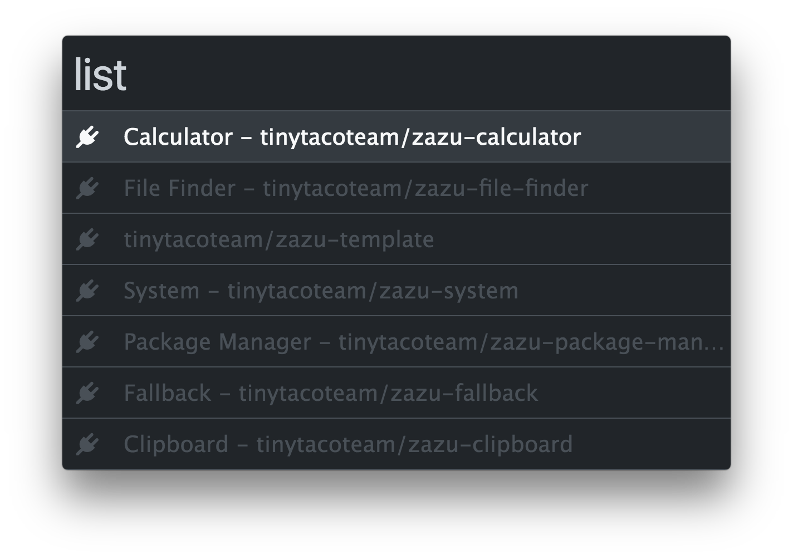

## Zazu Package Manager

## Commands

### Installing

You can type `install foo` to search for a `foo` package to install.

### Uninstalling

Type `uninstall foo` to search for a `foo` package to uninstall.

### List

To list all installed plugins type in `list`, which also accepts an argument.
Clicking one will go to the plugin homepage.

